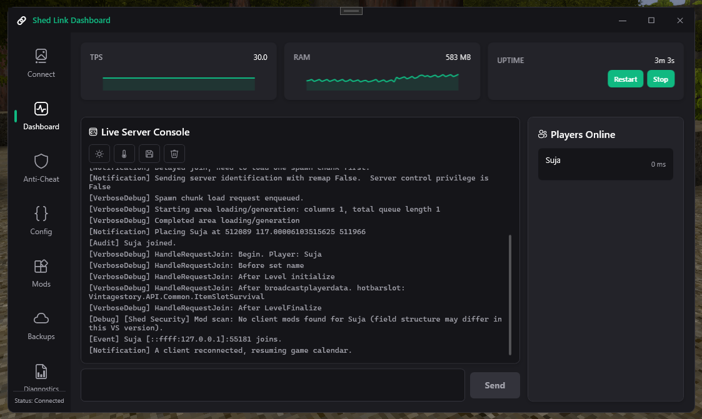
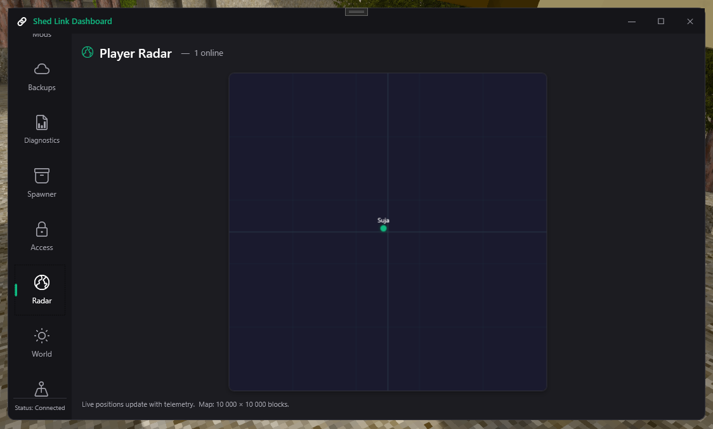
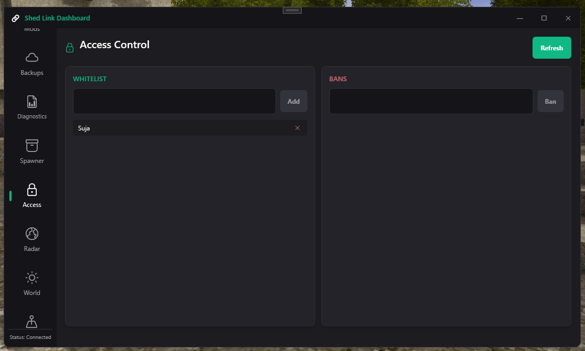
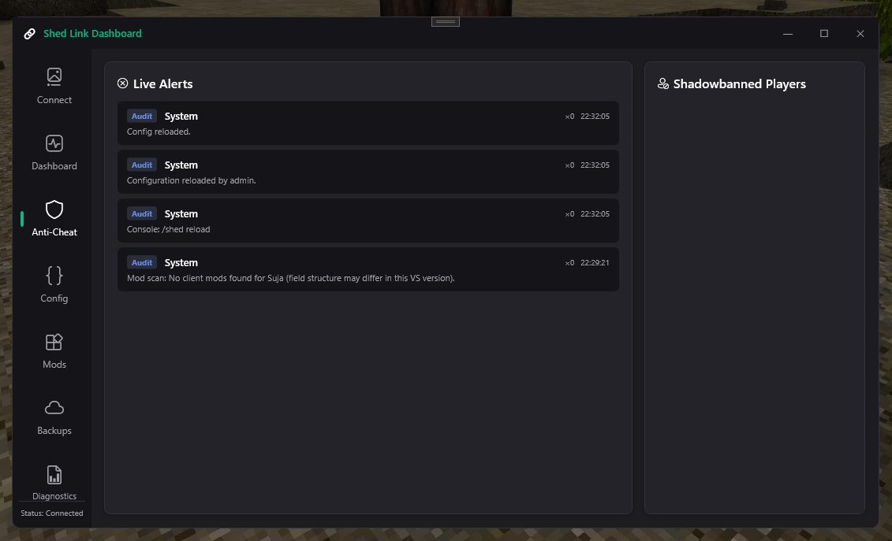
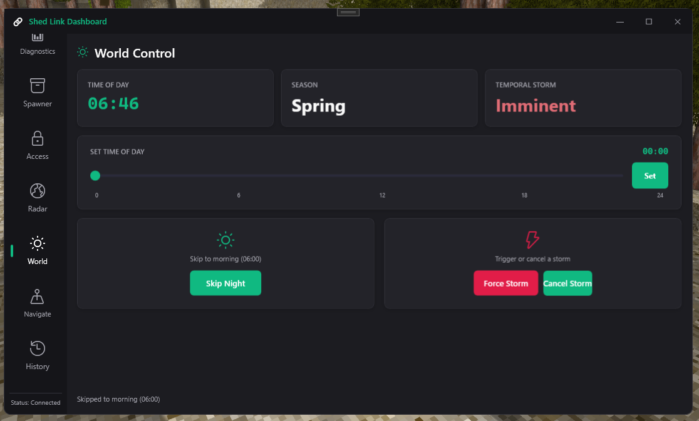
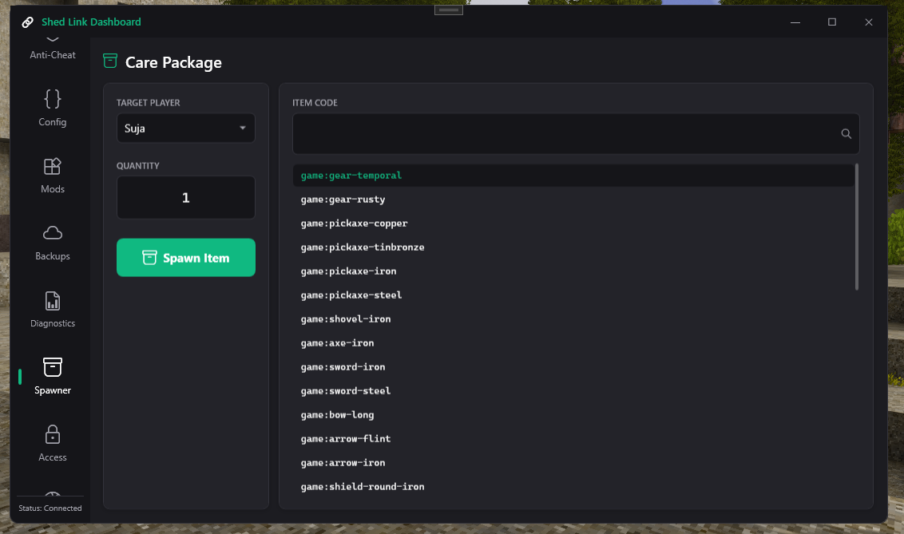
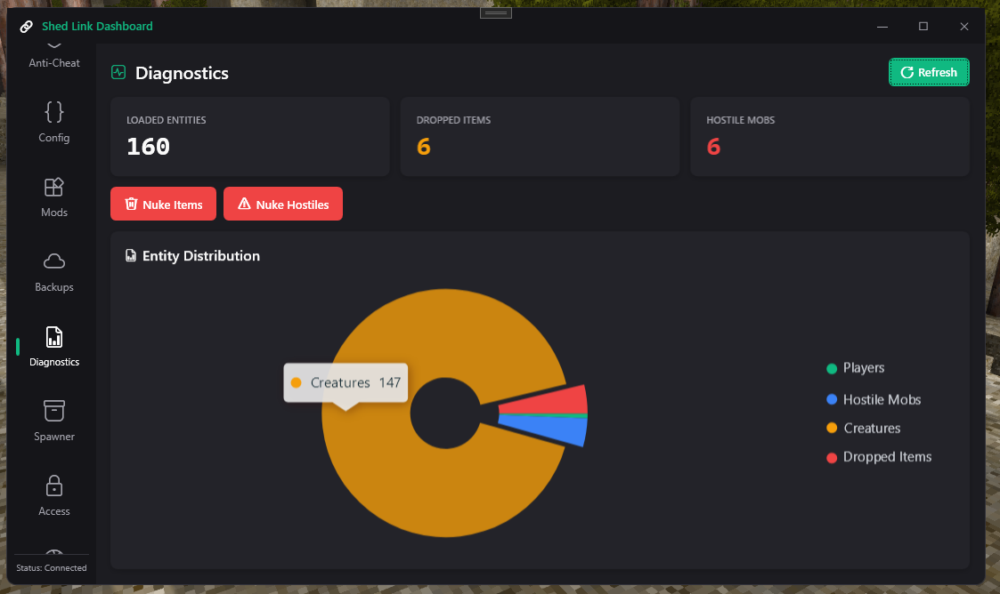
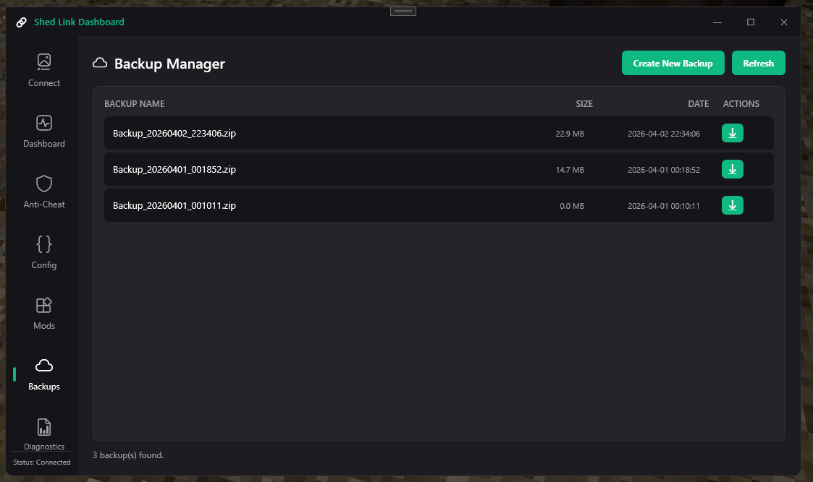
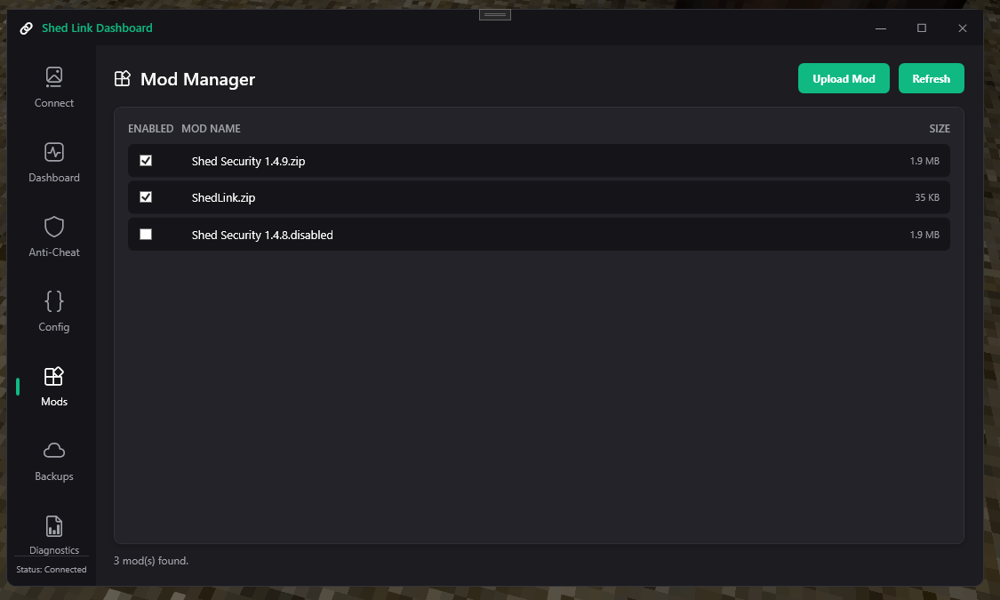
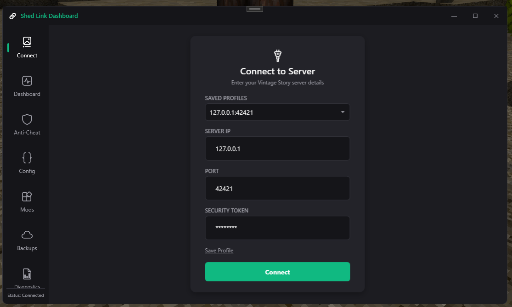

# ShedLink for Vintage Story

A powerful, real-time server administration dashboard for Vintage Story (v1.19 - v1.22+). 

ShedLink a server-side C# mod (`ShedLink`) that safely hooks into the Vintage Story API, and a lightweight, standalone Windows desktop application (`ShedLink Dashboard`) that gives server owners total control over their world without needing to memorize console commands.



## ✨ Key Features

### 🛡️ Player & Access Management
* **Live Player Tracking & Radar:** Monitor connected players, their inventories, and real-time relative coordinates.



* **Access Control:** Add or remove players from the server Whitelist and Banlist with a single click, automatically syncing with the server.



* **Anti-Cheat Validation:** Built-in checks for client-side modifications and irregular movement patterns.



### 🌍 World & Entity Control
* **Time & Weather Manipulation:** Instantly set the time of day or start/stop Temporal Storms programmatically.



* **Entity Management & Quick Spawner:** View live entity counts (items, hostiles, passives). Give items directly to players, or use the "Nuke Hostiles" feature to instantly despawn all aggressive mobs (Drifters, Wolves, Bears, Locusts, Bells) to clear up server lag or protect players.



### 💻 System Diagnostics & Backups
* **Server Health & Configs:** Monitor active chunks, loaded entities, server tick rates, and edit server configurations on the fly.



* **One-Click Backups:** Trigger safe, off-thread world saves and `.zip` backups directly from the desktop dashboard.



* **Mod Management:** View, upload, and disable server mods without needing FTP access.



---

## 🏗️ Architecture

1. **ShedLink (Server Mod):** A highly optimized Vintage Story `.dll` mod. It opens a secure network protocol to listen for dashboard connections. Built with cached reflection to maintain zero-overhead backwards compatibility across Vintage Story versions 1.19 through 1.22+.
2. **ShedLink Dashboard (Desktop Dashboard):** A .NET 10 Windows Presentation Foundation (WPF) application compiled as a single-file executable for easy distribution. 

---

## 🚀 Installation & Setup

### For Server Owners
1. Download the latest `ShedLink.zip` from the [Releases](link-to-releases) page.
2. Drop the `.zip` into your Vintage Story server's `Mods` folder.
3. Restart your server. ShedLink will automatically initialize and begin listening for dashboard connections on the default port.

### For Administrators
1. Download the latest `ShedLink.exe` from the [Releases](link-to-releases) page.
2. Run the application (no installation required).
3. Enter your server's IP address and the ShedLink connection port.



4. Authenticate and begin managing your server!

---

## ⚠️ Important Notes & Troubleshooting

* **Windows Admin Rights:** If you are hosting the Vintage Story server on a Windows machine, the server terminal/application **must be run as an Administrator**. Without admin privileges, Windows will block ShedLink from opening the necessary network ports, and the dashboard will be unable to connect.
* **Port Conflicts:** ShedLink defaults to listening on port `42420`. If your dashboard cannot connect—or if you know that port is already in use by another application—change the ShedLink port to `42421` (or another open port) in the server mod's configuration file, and update the port in your dashboard login screen to match.

---

## 🛠️ Building from Source

### Prerequisites
* Visual Studio 2022 (or equivalent IDE)
* .NET 8.0 SDK (For the Vintage Story Mod)
* .NET 10.0 SDK (For the Desktop Dashboard)
* Vintage Story Server API (`VintagestoryAPI.dll`)

### Building the Dashboard
The WPF dashboard is configured for a Framework-Dependent or Single-File Publish targeting `win-x64`. 
```bash
dotnet publish "Shed Security AP.csproj" -c Release -r win-x64 /p:PublishSingleFile=true
